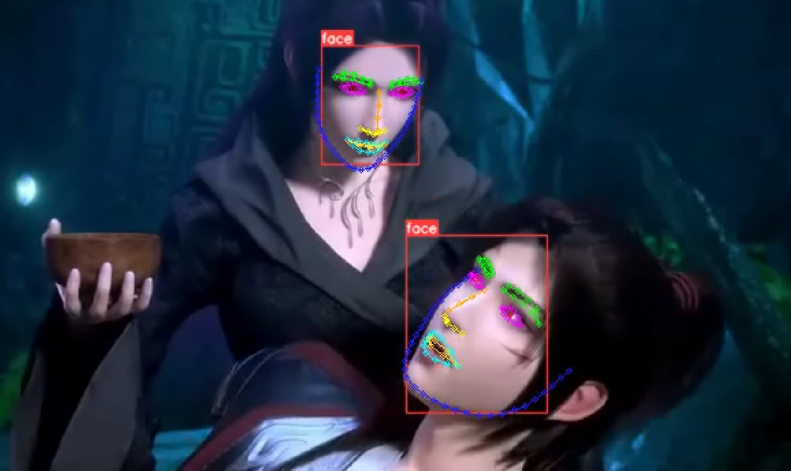

# 人脸关键点检测项目说明

本项目的实现主要依靠两个算法：yolov5目标检测和resnet人脸关键点算法。

其中目标检测算法为人脸关键点检测算法的前置算法，使用目标检测算法将人脸信息进行提取(起到前景与背景的分离)，然后再对box内的人脸信息进行关键点检测。

本项目支持功能：

人脸关键点的训练：√

人脸关键点的视频检测：√

注：本项目为人脸关键点检测，**人脸目标检测训练部分**没有在本项目中。

------

# 环境说明

```
torch>=1.5
tqdm>=4.62.2

```

# 数据集

人脸关键点数据集采用的是**WFLW**数据集

本项目的人脸标签为98个关键点信息，标注信息如下图所示：


数据集的详细介绍可参考：https://wywu.github.io/projects/LAB/WFLW.html  

```
  @inproceedings{wayne2018lab,  
  author = {Wu, Wayne and Qian, Chen and Yang, Shuo and Wang, Quan and Cai, Yici and Zhou, Qiang},  
  title = {Look at Boundary: A Boundary-Aware Face Alignment Algorithm},  
  booktitle = {CVPR},  
  month = June,  
  year = {2018}  
  }   
```

数据集百度云：

链接：[人脸关键点数据集](https://pan.baidu.com/s/1hAe-8JMKVMeOq-8H_xH_GQ)
提取码：yypn 

将下载的数据集放在**datasets**文件中，目录形式如下：

```bash
datasets/
|-- WFLW_annotations  # 存放标签信息
`-- WFLW_images  # 存放图像
```

------

# 项目使用方法

本项目提供已训练的权重，下载权重并保存到weights。百度云权重链接：

链接：[权重链接](https://pan.baidu.com/s/1tqRcr7Q_FMIAqZffpkRqKQ)
提取码：yypn 

## 模型训练

根目录下运行命令： python train.py     (注意脚本内相关参数配置 )   

## 视频检测

根目录下运行命令： python predict.py   (注意脚本内相关参数配置  )  

该部分为有偿提供

例如：

```
python predict.py --source demo.mp4 --yolo_weight weights/yolov5_face.pt --face_weight weights/resnet_50-epoch-724.pth
```

效果展示如下：



